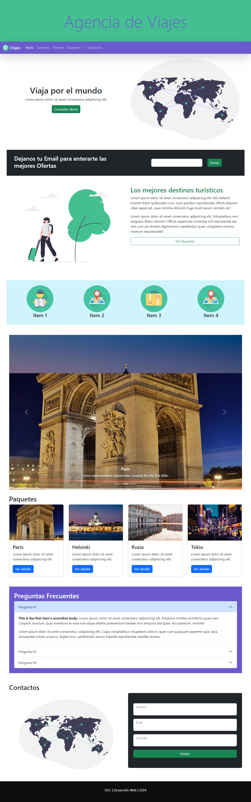

# Clase 11 - Bootstrap

## 🎯 Temas de la clase

📌 **Componentes con JavaScript** 
- Menú de navegación
- Anclas
- Ventanas modales
- Utilidades de Bootstrap: Flexbox y boxmodel
- Personalizar los estilos de bootstrap

